# SCRIPT: Check-AD-Replication-Latency-Convergence

## AUTHOR/FEEDBACK

* Written By: Jorge de Almeida Pinto [MVP Security / Lead Identity/Security Architect]
* Re-Written By: N.A.
* Company: IAMTEC &gt;&gt; Identity | Security | Recovery [https://www.iamtec.eu/]
* Blog: Jorge's Quest For Knowledge [http://jorgequestforknowledge.wordpress.com/]
* For Feedback/Questions: scripts DOT gallery AT iamtec.eu
  * Please Describe Your Scenario As Best As Possible With As Much Detail As Possible.
  * If Applicable Describe What Does and/Or Does Not Work.
  * If Applicable Describe What Should Be/Work Different And Explain Why/How.
  * Please Add Screendumps.

## ORIGINAL SOURCE(S)

* <https://github.com/zjorz/Public-AD-Scripts/blob/master/Check-AD-Replication-Latency-Convergence.ps1>

## DISCLAIMER

* The script is FREEWARE, you are free to distribute/update it, but always refer to the original source(s) as the location where you got it
* This script is furnished "AS IS". NO warranty is expressed or implied!
* I HAVE NOT tested it in every scenario or environment
* ALWAYS TEST FIRST in lab environment to see if it meets your needs!
* Use this script at YOUR OWN RISK! YOU ARE RESPONSIBLE FOR ANY OUTCOME/RESULT BY USING THIS SCRIPT!
* I DO NOT warrant this script to be fit for any purpose, use or environment!
* I have tried to check everything that needed to be checked, but I DO NOT guarantee the script does not have bugs!
* I DO NOT guarantee the script will not damage or destroy your system(s), environment or anything else due to improper use or bugs!
* I DO NOT accept liability in any way when making mistakes, use the script wrong or in any other way where damage is caused to your environment/systems!
* If you do not accept these terms DO NOT use the script in any way and delete it immediately!

## KNOWN ISSUES/BUGS

* The content of the HTML file in the browser might suddenly appear to be blank. This might resolve by itself during the refresh or when the admin refreshes manually
* Reachability of a certain DC depends on the required port being open, AND the speed a DC responds back. If the configured timeout is too low while a high latency is experienced, increase the configured timeout by using the XML configuration file

## RELEASE NOTES

* v1.0, 2024-12-11, Jorge de Almeida Pinto [MVP Security / Lead Identity/Security Architect]:

  * Improved User Experience: Changed the layout of the output on screen to display a summary of the progress.
  * Improved User Experience: Added URL for documentation to the ORIGINAL SOURCE(S) section above
  * Improved User Experience: Support for an XML file to specify environment specific connection parameters. At the same time this also allows upgrades/updates of the script without loosing those specify environment specific connection parameters
  * Improved User Experience: For a more detailed view of the progress, that information will automatically be displayed through an HTML file in a browser and refreshed every 5 seconds to display any changes.
  * Code Improvement: Implemented StrictMode Latest Version (Tested On PoSH 5.x And 7.x)
  * Code Improvement: Replaced "Get-WmiObject" with "Get-CimInstance" to also support PowerShell 7.x
  * New Feature: Added the function "showProgress" to display the progress of an action
  * New Feature: Added parameter to skip opening the HTML in a browser to support automation

* v0.9, 2024-09-03, Jorge de Almeida Pinto [MVP Security / Lead Identity/Security Architect]:

  * Improved User Experience: Added at the beginning the output of the command line and all parameters used
  * Improved User Experience: Faster processing due to paralellel processing through RunSpaces. (MAJOR CHANGE and WILL IMPACT CPU/RAM usage when checking against many members!)
      To configure the behavior of the processing in the Runspaces, review and update as needed the variables "$runspacePoolMinThreads", "$runspacePoolMaxThreads" And "$delayInMilliSecondsBetweenChecks"
      Inspired by:
      <https://blog.netnerds.net/2016/12/runspaces-simplified/>
      <https://blog.netnerds.net/2016/12/immediately-output-runspace-results-to-the-pipeline/>
      <https://github.com/EliteLoser/misc/blob/master/PowerShell/PowerShell%20Runspace%20Example%20Template%20Code.ps1>
      <https://devblogs.microsoft.com/scripting/beginning-use-of-powershell-runspaces-part-1/>
      <https://devblogs.microsoft.com/scripting/beginning-use-of-powershell-runspaces-part-2/>
      <https://devblogs.microsoft.com/scripting/beginning-use-of-powershell-runspaces-part-3/>
      <https://devblogs.microsoft.com/scripting/weekend-scripter-a-look-at-the-poshrsjob-module/>
  * Bug Fix: Added forgotten parameter to automatically cleanup orphaned canary objects when found
  * New Feature: Added parameter to skip cleaning of orphaned canary objects when found
  * New Feature: Added variable that specifies the delay in milliseconds between the checks for each DC/GC. The default is 0, which means NO DELAY and go for it!
  * New Feature: Added a parameter to allow the export of the results into a CSV

* v0.8, 2024-07-30, Jorge de Almeida Pinto [MVP Security / Lead Identity/Security Architect]:

  * Bug Fix: Fixed case sensitivity bug when specifying a Naming Context DN through the command line

* v0.7, 2024-02-06, Jorge de Almeida Pinto [MVP Security / Lead Identity/Security Architect]:

  * Improved User Experience: Added a check to determine if there are Temporary Canary Object leftovers from previous executions of the script that were not cleaned up because the script was aborted or it crashed
  * Improved User Experience: Previous the delta time was calculated when the object was found by the script and compare it to the start time. Now it provided 2 different timings:
  * The "TimeDiscvrd" (Time Discovered) specifies how much time it took to find/see the object on a DC
  * The "TimeReplctd" (Time Replicated) specifies how much time it took to reach the DC
  * Bug Fix: Fixed issue when the fsmoroleowner property did not contain a value
  * Improved User Experience: The naming context list presented is now consistently presented in the same order

* v0.6, 2024-01-31, Jorge de Almeida Pinto [MVP Security / Lead Identity/Security Architect]:
  * Code Improvement: Added additional information, minor changes

* v0.5, 2024-01-28, Jorge de Almeida Pinto [MVP Security / Lead Identity/Security Architect]:

  * Script Improvement: Complete rewrite of the script
  * New Feature: Parameters added to support automation
  * New Feature: Logging Function
  * New Feature: Support for all NCs (Configuration Partition As The Forest NC, Domain NCs With Domain Only Or Also Including GCs In Other AD Domains, And App NCs)
  * Code Improvement: As target RWDC use specific role owner, disccovered RWDC, specific RWDC

* v0.4, 2014-02-11, Jorge de Almeida Pinto [MVP Security / Lead Identity/Security Architect]:
  * Code Improvement: Added additional logic to determine if a DC is either an RWDC or RODC when it fails using the first logic and changed the layout a little bit

* v0.3, 2014-02-09, Jorge de Almeida Pinto [MVP Security / Lead Identity/Security Architect]:
  * Bug Fix: Solved a bug with regards to the detection/location of RWDCs and RODCs

* v0.2, 2014-02-01, Jorge de Almeida Pinto [MVP Security / Lead Identity/Security Architect]:

  * New Feature: Added STOP option
  * Added few extra columns to output extra info of DCs,
  * Code Improvement: Better detection of unavailable DCs/GCs
  * Added screen adjustment section

* v0.1, 2013-03-02, Jorge de Almeida Pinto [MVP Security / Lead Identity/Security Architect]:
  * Initial version of the script

## SYNOPSIS/DESCRIPTION

This PoSH Script Checks The AD Replication Latency/Convergence Across Specified NC And Replication Scope

This PoSH script provides the following functions:

* It executes all checks in parallel at the same time against all DCs/GCs in scope.
* It executes on a per specified NC basis. For multiple NCs use automation with parameters
* For automation, it is possible to define the DN of an naming context, the replication scope (only applicable for domain NCs), and the RWDC to use as the source RWDC to create the temporary canary object on
* It supports non-interacive mode through automation with parameters, or interactive mode
* It supports AD replication convergence check for any NC within an AD forest.
  * Configuration Partition As The Forest NC to test AD replication convergence/latency across the AD forest. Connectivity check to DCs through TCP:LDAP/389 for the purpose of checking the existance of the canary object
  * Domain NCs with domain only scope to test AD replication convergence/latency across the AD domain. Connectivity check to DCs through TCP:LDAP/389
  * Domain NCs with domain and GCs scope to test AD replication convergence/latency across the AD domain and the GCs in other AD domains. Connectivity check to DCs through TCP:LDAP/389, and GCs through TCP:LDAP-GC/3268
  * App NCs to test AD replication convergence/latency across the application partition. Connectivity check to DCs through TCP:LDAP/389
* As the source RWDC, it is possible to:
  * Use the FSMO
    * For the Configuration Partition  =&gt; FSMO = RWDC with Domain Naming Master FSMO Role (Partitions (Container) Object, Attribute fSMORoleOwner has NTDS Settings Object DN of RWDC)
    * For the Domain Partition         =&gt; FSMO = RWDC with PDC Emulator FSMO Role (Domain NC Object, Attribute fSMORoleOwner Has NTDS Settings Object DN of RWDC)
    * For the Application Partition    =&gt; FSMO = RWDC with Infrastructure Master FSMO Role (Infrastructure Object, Attribute fSMORoleOwner has NTDS Settings Object DN of RWDC)
  * Use a discovered RWDC (best effort, especially with application partitions)
  * Specified the FQDN of a RWDC that hosts the naming context
* For the temporary canary object:
  * Initially created on the source RWDC and deleted from the source RWDC at the end
  * ObjectClass     = contact
  * Name            = _adReplConvergenceCheckTempObject_yyyyMMddHHmmss (e.g. _adReplConvergenceCheckTempObject_20240102030405)
  * Description     = ...!!!...TEMP OBJECT TO TEST AD REPLICATION LATENCY/CONVERGENCE THROUGH THE '&lt;NC TYPE&gt;'...!!!...
  * Container:
    * For the Configuration Partition  =&gt; Container = "CN=Services,CN=Configuration,DC=&lt;ROOT DOMAIN&gt;,DC=&lt;TLD&gt;"
    * For the Domain Partition         =&gt; Container = "CN=Users,DC=&lt;DOMAIN&gt;,DC=&lt;TLD&gt;"
    * For the Application Partition    =&gt; Container = "&lt;DN Of App Partition, e.g. DC=CustomAppNC OR DC=DomainDnsZones,DC=&lt;DOMAIN&gt;,DC=&lt;TLD&gt;"
  * Distinguished Name
    * For the Configuration Partition  =&gt; DN = "CN=_adReplConvergenceCheckTempObject_yyyyMMddHHmmss,CN=Services,CN=Configuration,DC=&lt;ROOT DOMAIN&gt;,DC=&lt;TLD&gt;"
    * For the Domain Partition         =&gt; DN = "CN=_adReplConvergenceCheckTempObject_yyyyMMddHHmmss,CN=Users,DC=&lt;DOMAIN&gt;,DC=&lt;TLD&gt;"
    * For the Application Partition    =&gt; DN = "CN=_adReplConvergenceCheckTempObject_yyyyMMddHHmmss,&lt;DN Of App Partition, e.g. DC=CustomAppNC OR DC=DomainDnsZones,DC=&lt;DOMAIN&gt;,DC=&lt;TLD&gt;"
* In the PowerShell command prompt window the global progress is displayed. The same thing is also logged to a log file
* When a default browser is available/configured, the generated HTML file will be opened and automatically refreshed every 5 seconds as the script progresses. This HTML file displays the DC specific state/result
* It checks if specified NC exists. If not, the script aborts.
* It checks if specified RWDC exists. If not, the script aborts.
* At the end it checks if any Temporary Canary Objects exist from previous execution of the script and offers to clean up (In the chosen NC only!).
* Disjoint namespaces and discontiguous namespaces are supported
* The script DOES NOT allow or support the schema partition to be targeted!
* The script uses default values for specific connection parameters. If those do not meet expectation, an XML configuration file can be used with custom values.
* For the specific NC, the script also checks if any remaining canary objects exists from previous script executions that either failed or were aborted. It provides the option to also clean those or not. Through a parameter
    it allows to default to always clean previous canary objects when found. This behavior is ignored when the parameter to skip the check of previous canary objects is used
* In addition to displaying the end results on screen, it is also possible to export those end results to a CSV file
* Through a parameter it is possible to not open the generated HTML in the default browser
* Through a parameter it is possible to skip the check of previous canary objects
* The script supports automation by using parameters with pre-specified details of the targeted Naming Context, if applicable the targeted Replication Scope and the targeted source RWDC

## PARAMETER(S)

cleanupOrhanedCanaryObjects

* With this parameter it is possible to automatically cleanup orphaned canary objects when found

exportResultsToCSV

* With this parameter it is possible to export the results to a CSV file in addition of displaying it on screen on in the log file

skipOpenHTMLFileInBrowser

* With this parameter it is possible to not open the HTML file in the default browser

skipCheckForOrphanedCanaryObjects

* With this parameter it is possible to not check for orphaned canary objects

targetedReplScope

* With this parameter it is possible to specify the replication scope when targeting a domain NC, being "Domain Only" (DomainOnly) or "Domain And GCs" (DomainAndGCs)

targetNCDN

* With this parameter it is possible to specify the DN of a naming Context to target for AD Replication Convergence/Latency check

targetRWDC

* With this parameter it is possible to specify the RWDC to use to create the temporary canary object on. Options that are available for this are "Fsmo", "Discover" or the FQDN of an RWDC

## EXAMPLE(S)

Check The AD Replication Convergence/Latency Using Interactive Mode

``` powershell
.\Check-AD-Replication-Latency-Convergence.ps1
```

Check The AD Replication Convergence/Latency Using Automated Mode For The NC "DC=CustomAppNC1" Using The Fsmo Role Owner As The Source RWDC To Create The Temporary Canary Object On

``` powershell
.\Check-AD-Replication-Latency-Convergence.ps1 -targetNCDN "DC=CustomAppNC1" -targetRWDC Fsmo
```

Check The AD Replication Convergence/Latency Using Automated Mode For The NC "CN=Configuration,DC=IAMTEC,DC=NET" Using The Fsmo Role Owner As The Source RWDC To Create The Temporary Canary Object On

``` powershell
.\Check-AD-Replication-Latency-Convergence.ps1 -targetNCDN "CN=Configuration,DC=IAMTEC,DC=NET" -targetRWDC Discover
```

Check The AD Replication Convergence/Latency Using Automated Mode For The NC "DC=IAMTEC,DC=NET" Using A Specific RWDC As The Source RWDC To Create The Temporary Canary Object On, And Only Check Within The Domain Itself

``` powershell
.\Check-AD-Replication-Latency-Convergence.ps1 -targetNCDN "DC=IAMTEC,DC=NET" -targetedReplScope DomainOnly -targetRWDC "R1FSRWDC1.IAMTEC.NET"
```

Check The AD Replication Convergence/Latency Using Automated Mode For The NC "DC=IAMTEC,DC=NET" Using A Specific RWDC As The Source RWDC To Create The Temporary Canary Object On, And Check Within The Domain And GCs

``` powershell
.\Check-AD-Replication-Latency-Convergence.ps1 -targetNCDN "DC=IAMTEC,DC=NET" -targetedReplScope DomainAndGCs -targetRWDC "R1FSRWDC1.IAMTEC.NET"
```

## NOTES

* To execute this script, the account running the script MUST have the permissions to create and delete the object type in the container used of the specified naming context. Being a member of the Enterprise Admins group
    in general allows the usage of the script against any naming context
* The credentials used are the credentials of the logged on account. It is not possible to provided other credentials. Other credentials could maybe be used through RUNAS /NETONLY /USER
* No check is done for the required permissions. The script simply assumes the required permissions are available. If not, errors will occur
* The script DOES NOT allow or support the schema partition to be targeted!
* No PowerShell modules are needed to use this script
* Script Has StrictMode Enabled For Latest Version - Tested With PowerShell 7.4.6
* Reachbility is determined by checking against the required ports (TCP:LDAP/389 for DCs, and where applicable TCP:LDAP-GC/3268) and if the DC/GC responds fast enough before the defined connection timeout
* The XML file for the environment specific oonnection parameters should have the exact same name as the script and must be in the same folder as the script. If the script is renamed, the XML should be renamed accordingly.
    For example, if the script is called "Check-AD-Replication-Latency-Convergence_v10.ps1", the XML file should be called "Check-AD-Replication-Latency-Convergence_v10.xml". When a decision is made to use the XML
    Configuration File, then ALL connection parameters MUST be defined in it. It is an all or nothing thing. The structure of the XML file is:

```XML
<!-- ============ Configuration XML file ============ -->
<?xml version="1.0" encoding="utf-8"?>
<checkADReplConvergence xmlns:xsi="http://www.w3.org/2001/XMLSchema-instance" xmlns:xsd="http://www.w3.org/2001/XMLSchema">
	<!-- Use The Connection Parameters In The XML Config File -->
	<useXMLConfigFileSettings>TRUE_OR_FALSE</useXMLConfigFileSettings>

	<!-- Default In Script = 500 | When Checking If The Host Is Reachable Over Certain Port, This Is The Timeout In Milliseconds -->
	<connectionTimeoutInMilliSeconds>REPLACE_WITH_NUMERIC_VALUE</connectionTimeoutInMilliSeconds>

	<!-- Default In Script = 30 | When Checking The Canary Object Against A Certain DC/GC, And The DC/GC Is Reachable, This Is The Amount Of Minutes, When Exceeded, It Stops Checking That DC/GC (This Could Be The Case When AD Replication Is Broken Somehow Or The DC/GC Is In A Unhealthy State) -->
	<timeoutInMinutes>REPLACE_WITH_NUMERIC_VALUE</timeoutInMinutes>

	<!-- Default In Script = 1 | Minimum Amount Of Threads Per Runspace Pool -->
	<runspacePoolMinThreads>REPLACE_WITH_NUMERIC_VALUE</runspacePoolMinThreads>

	<!-- Default In Script = 2048 | Minimum Amount Of Threads Per Runspace Pool -->
	<runspacePoolMaxThreads>REPLACE_WITH_NUMERIC_VALUE</runspacePoolMaxThreads>

	<!-- Default In Script = 500 | The Check Delay In Milliseconds Between Checks Against Each Individual DC/GC -->
	<delayInMilliSecondsBetweenChecks>REPLACE_WITH_NUMERIC_VALUE</delayInMilliSecondsBetweenChecks>
</checkADReplConvergence>
<!-- ============ Configuration XML file ============ -->
```

## SCREENSHOTS (NEW WAY OF EXECUTION AND PROCESSING!)

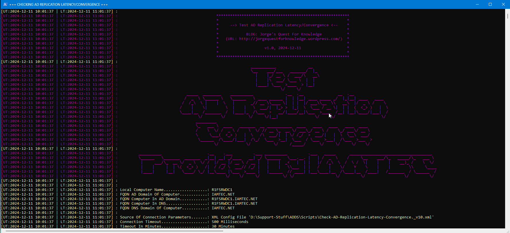

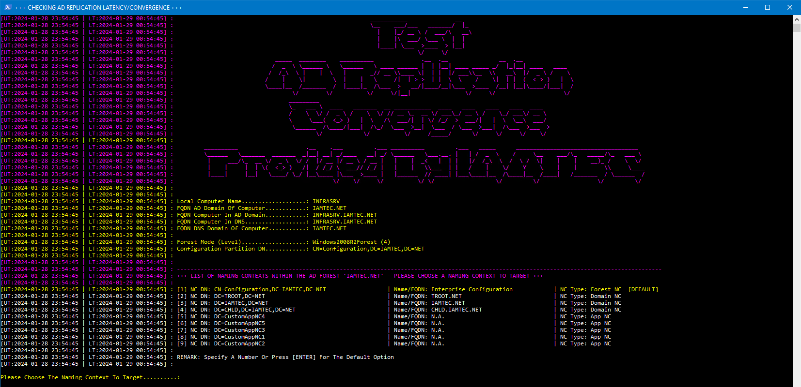

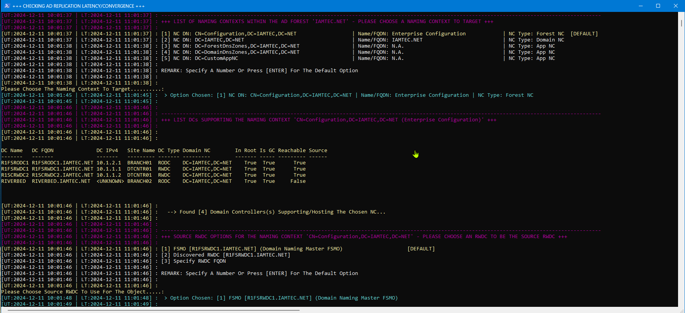

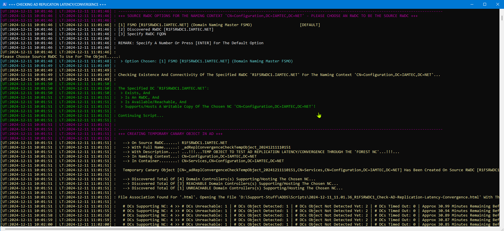

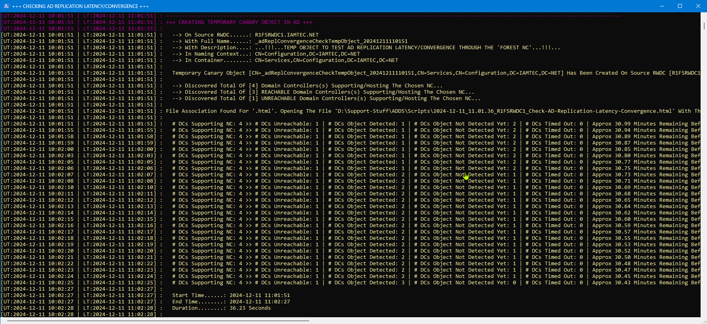

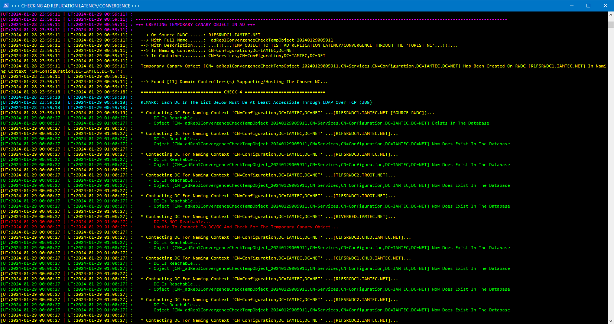

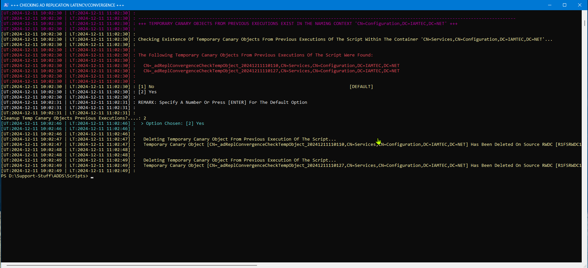

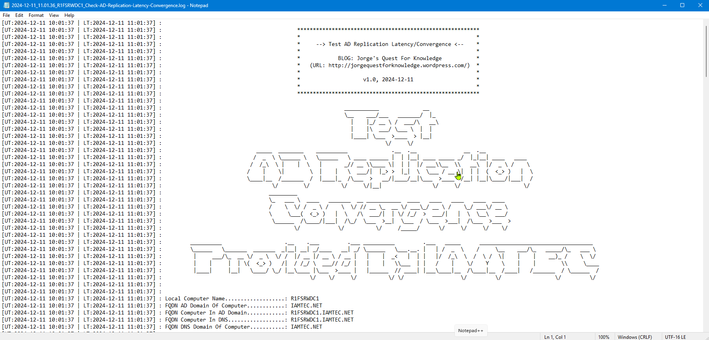

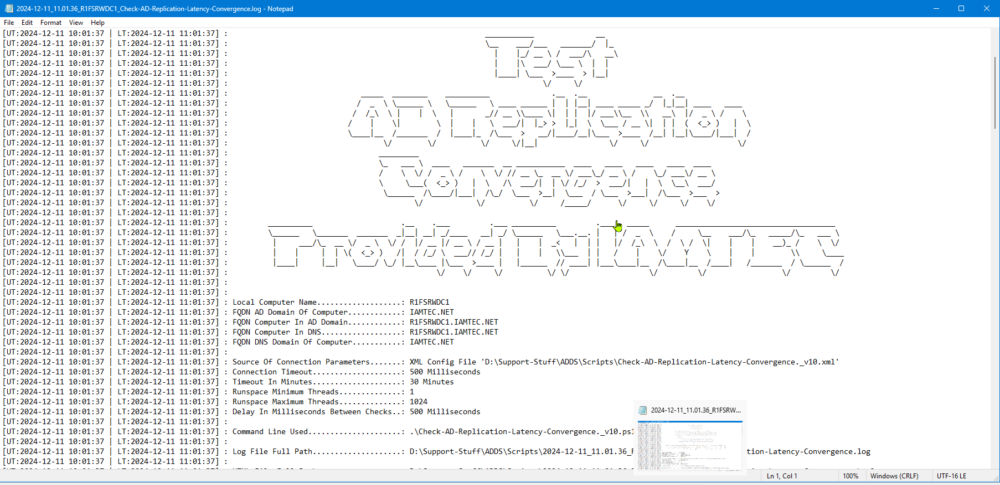

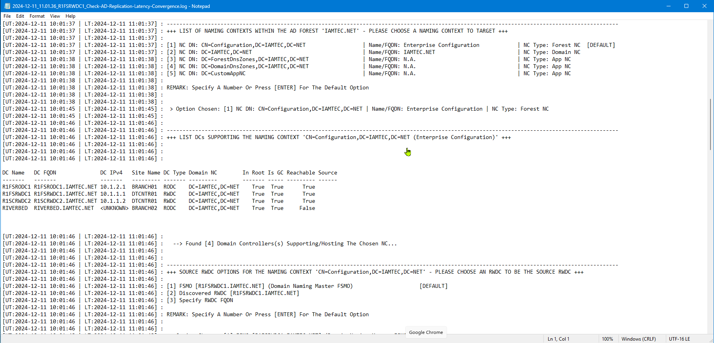

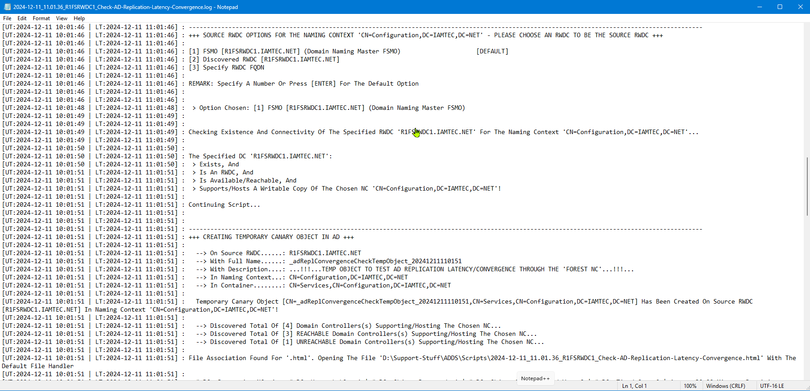

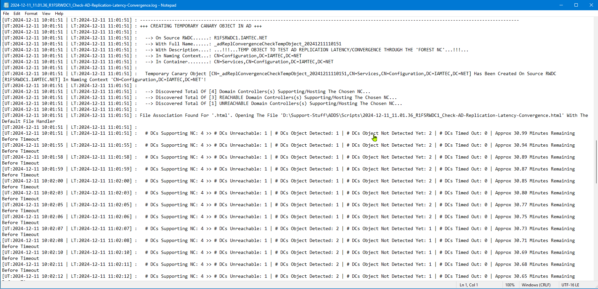

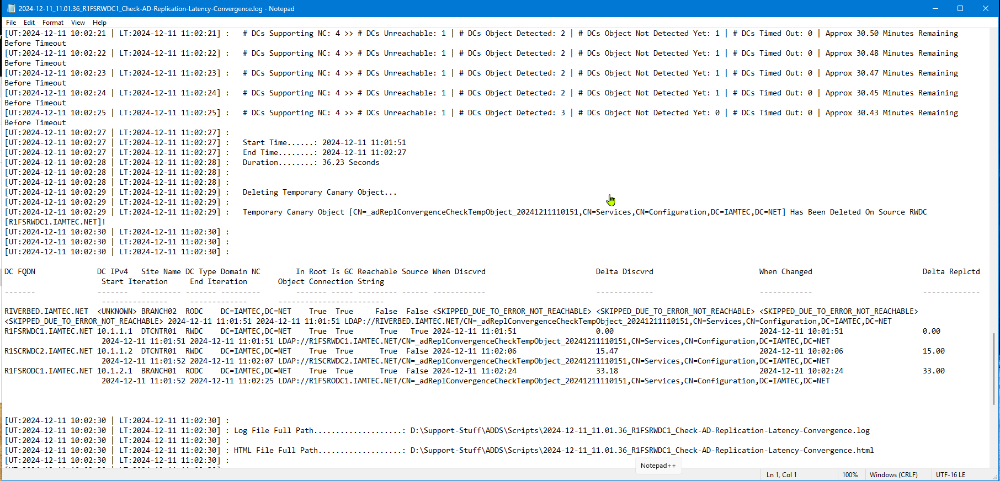

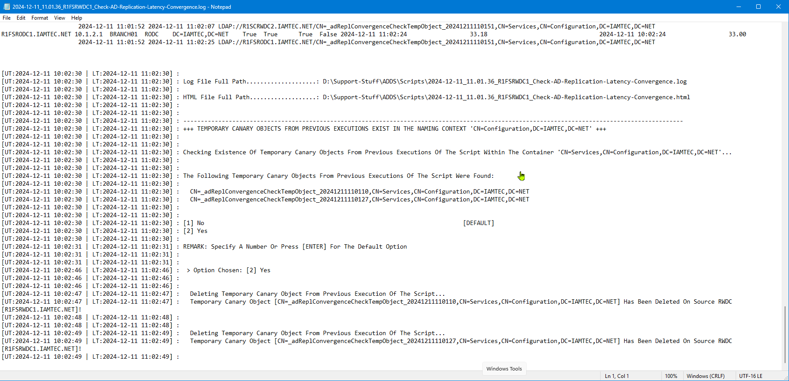

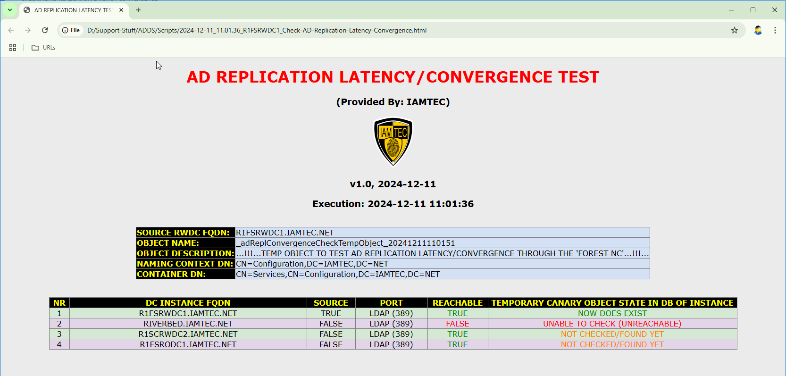


## SCREENSHOTS (PREVIOUS WAY OF EXECUTION AND PROCESSING!)

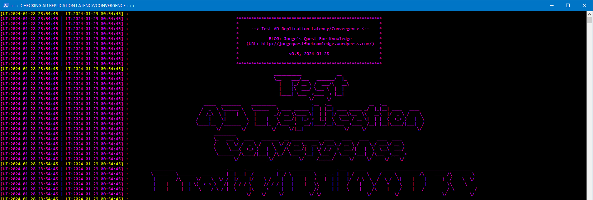


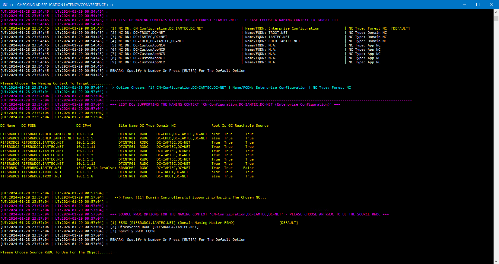


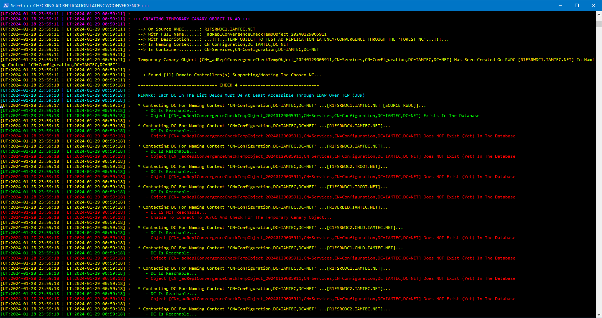


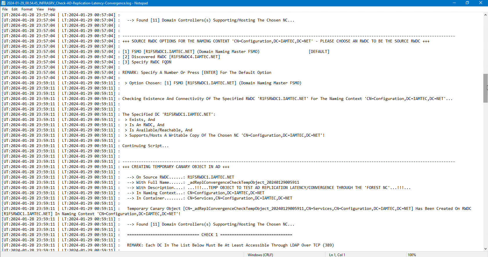

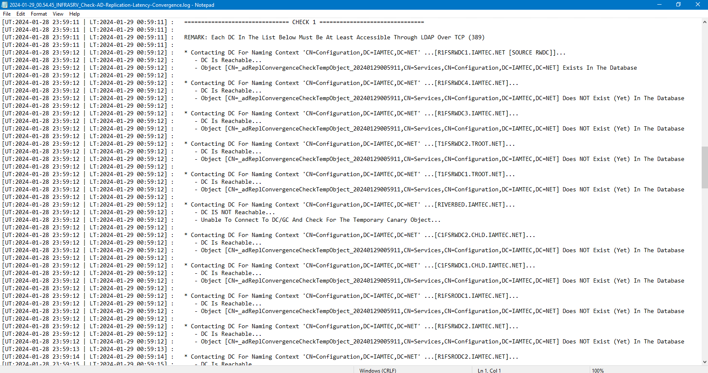


