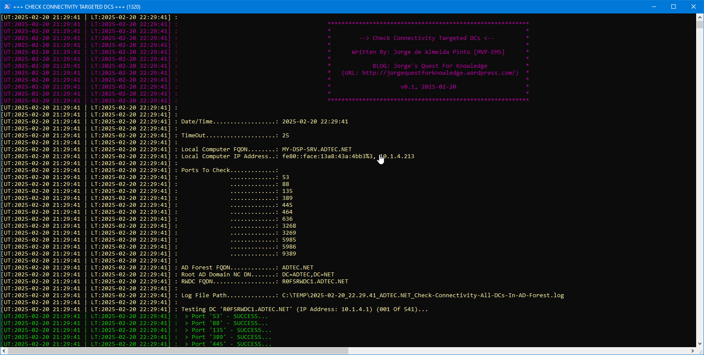
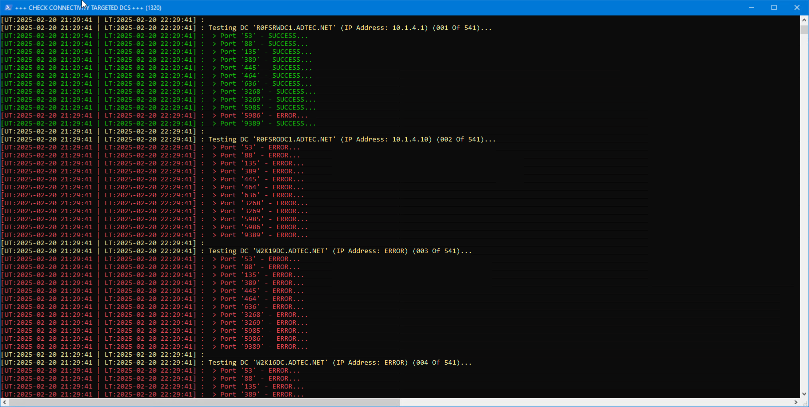
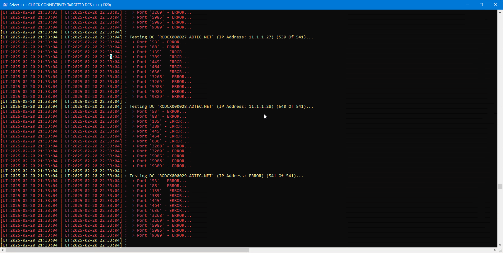
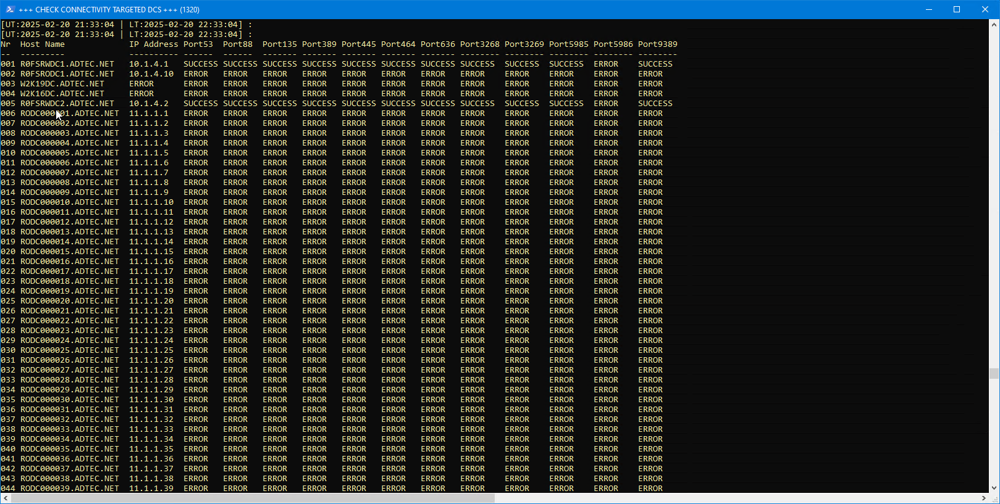
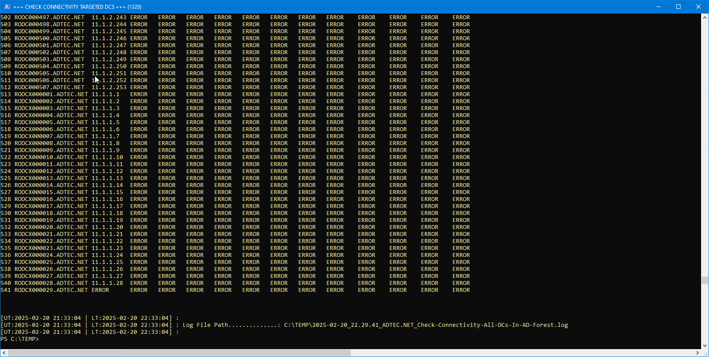

# SCRIPT: Check-Connectivity-All-DCs-In-AD-Forest

## AUTHOR/FEEDBACK

* Written By: Jorge de Almeida Pinto [MVP Security / Lead Identity/Security Architect]
* Re-Written By: N.A.
* Company: IAMTEC &gt;&gt; Identity | Security | Recovery [https://www.iamtec.eu/]
* Blog: Jorge's Quest For Knowledge [http://jorgequestforknowledge.wordpress.com/]
* For Feedback/Questions: scripts DOT gallery AT iamtec.eu
  * Please Describe Your Scenario As Best As Possible With As Much Detail As Possible.
  * If Applicable Describe What Does and/Or Does Not Work.
  * If Applicable Describe What Should Be/Work Different And Explain Why/How.
  * Please Add Screendumps.

## ORIGINAL SOURCE(S)

* Script:  <https://github.com/zjorz/Public-AD-Scripts/blob/master/Check-Connectivity-All-DCs-In-AD-Forest.ps1>

## DISCLAIMER

* The script is FREEWARE, you are free to distribute/update it, but always refer to the original source(s) as the location where you got it
* This script is furnished "AS IS". NO warranty is expressed or implied!
* I HAVE NOT tested it in every scenario or environment
* ALWAYS TEST FIRST in lab environment to see if it meets your needs!
* Use this script at YOUR OWN RISK! YOU ARE RESPONSIBLE FOR ANY OUTCOME/RESULT BY USING THIS SCRIPT!
* I DO NOT warrant this script to be fit for any purpose, use or environment!
* I have tried to check everything that needed to be checked, but I DO NOT guarantee the script does not have bugs!
* I DO NOT guarantee the script will not damage or destroy your system(s), environment or anything else due to improper use or bugs!
* I DO NOT accept liability in any way when making mistakes, use the script wrong or in any other way where damage is caused to your environment/systems!
* If you do not accept these terms DO NOT use the script in any way and delete it immediately!

## KNOWN ISSUES/BUGS

* N.A.

## RELEASE NOTES

* v0.1, 2025-02-20, Jorge de Almeida Pinto [MVP Identity And Access - Security / Lead Identity/Security Architect]:
  * Initial version of the script

## SYNOPSIS/DESCRIPTION

This PoSH Script Test Connectivity To Targeted DCs For Specified (TCP) Ports

This PoSH script provides the following functions:

* Create a list of DCs to target
* Check connectivity for specified TCP ports for targeted DCs

## PARAMETER(S)

N.A.

## EXAMPLE(S)

Execute The Script - On-Demand

``` powershell
.\Check-Connectivity-All-DCs-In-AD-Forest.ps1
```

## NOTES

* N.A.

## SCREENSHOTS










